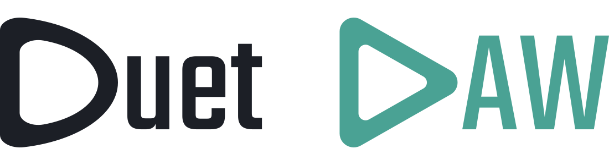
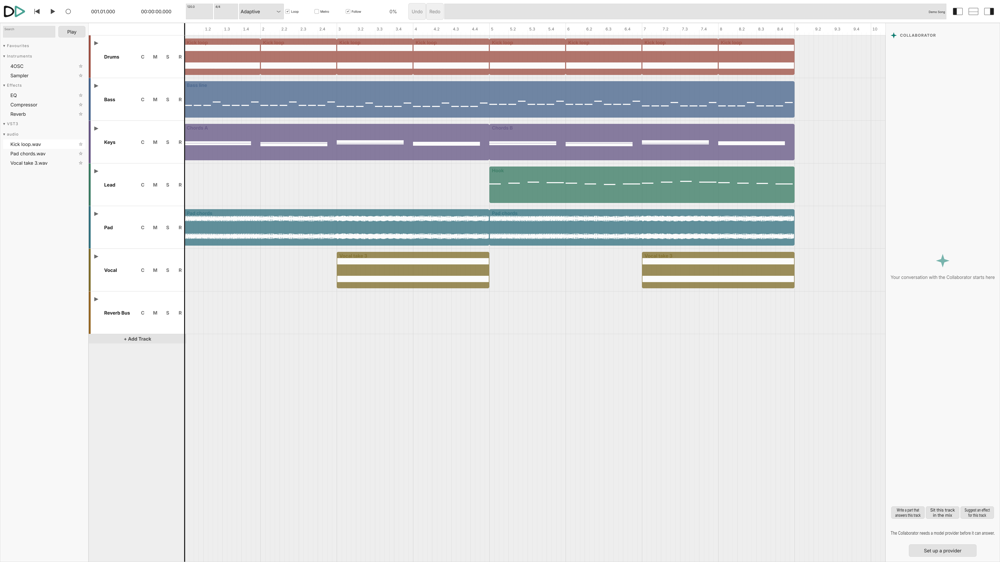
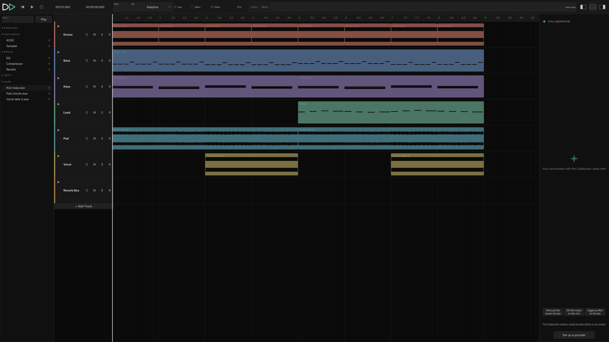
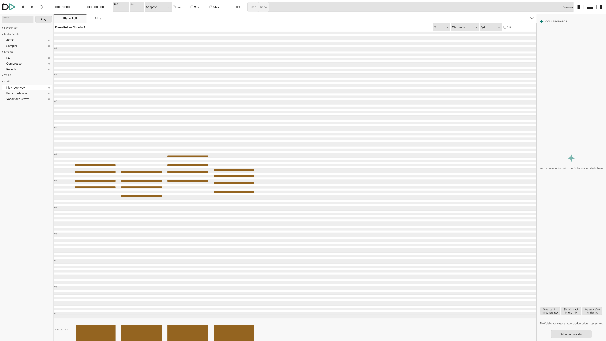
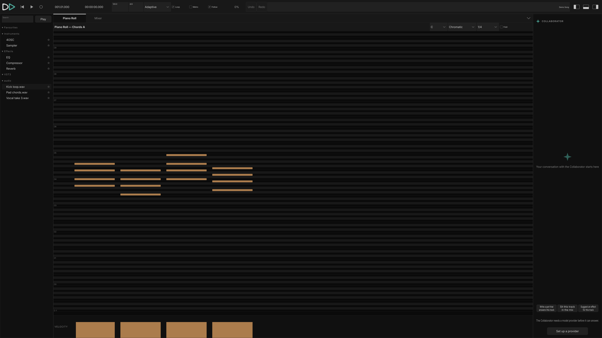
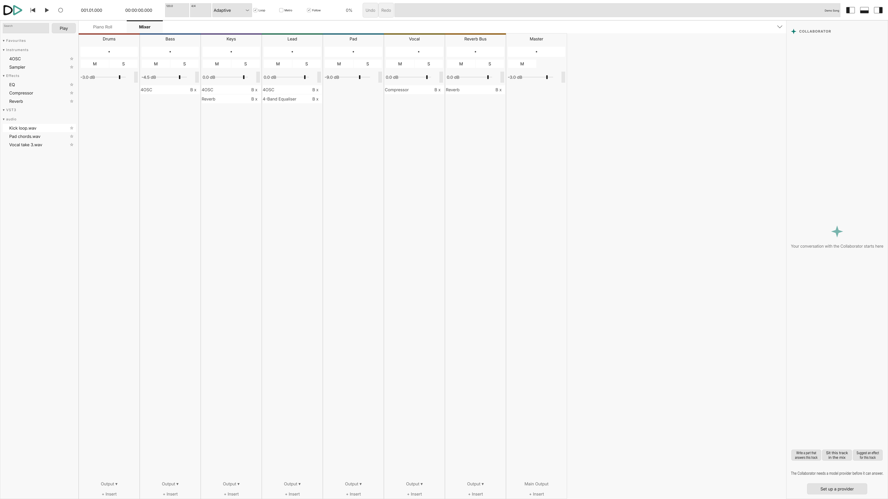
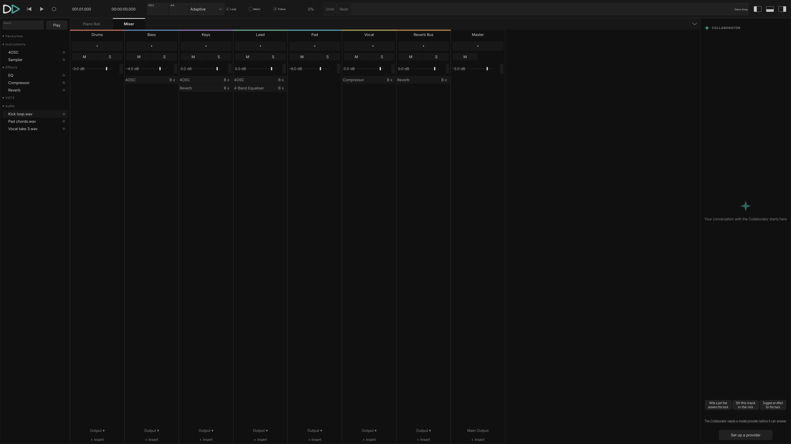
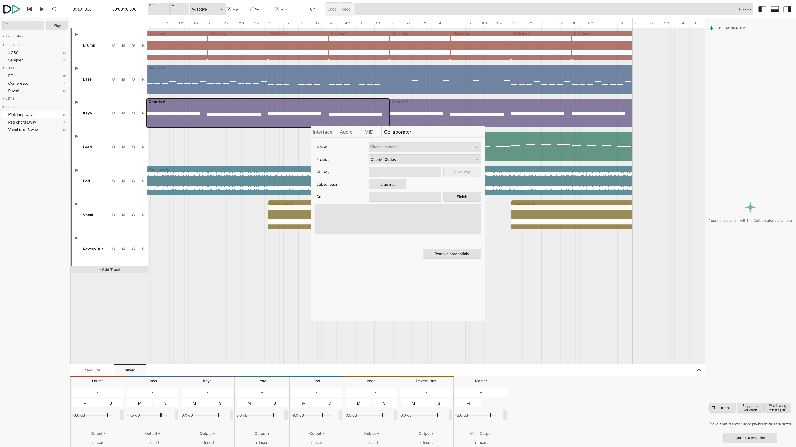
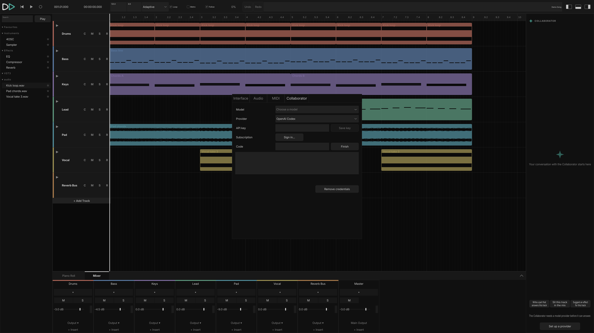

<p align="center">
  <picture>
    <source media="(prefers-color-scheme: dark)" srcset="docs/assets/logo-full-dark.svg">
    
  </picture>
</p>

<p align="center">
  <b>A desktop digital audio workstation with an AI participant built in.</b><br>
  Written in C++ on <a href="https://juce.com">JUCE</a> and <a href="https://www.tracktion.com/develop/tracktion-engine">Tracktion Engine</a>.<br>
  The Collaborator reads the project through tools, proposes Suggestions, and never changes a note without you.
</p>

<p align="center">
  <a href="https://github.com/builtbystef/duet-daw/actions/workflows/ci.yml"></a>
  <a href="https://github.com/builtbystef/duet-daw/actions/workflows/nightly.yml"></a>
  <a href="LICENSE"></a>
</p>

<p align="center">
  <a href="#screenshots">Screenshots</a> ·
  <a href="#how-the-collaborator-works">The Collaborator</a> ·
  <a href="#what-is-in-it">Features</a> ·
  <a href="#status">Status</a> ·
  <a href="#building-from-source">Building</a> ·
  <a href="#architecture">Architecture</a> ·
  <a href="#development">Development</a> ·
  <a href="#contributing">Contributing</a>
</p>

---

Duet is a desktop digital audio workstation with an AI participant built in. The AI participant is called the Collaborator. It reads the project through a fixed set of read-only tools, not through audio. It cannot change the project by itself. What it produces is a Suggestion, which the producer can listen to, change, take parts of, accept, or reject. An accepted Suggestion becomes one normal undo step.

## Screenshots

Duet has a light and a dark theme and follows the desktop's setting. Light is on the left, dark on the right.

<table>
  <tr>
    <td align="center">Arrangement, with the Browser, the Mixer and the Collaborator panel</td>
    <td align="center"></td>
  </tr>
  <tr>
    <td></td>
    <td></td>
  </tr>
  <tr>
    <td align="center">Piano roll</td>
    <td align="center"></td>
  </tr>
  <tr>
    <td></td>
    <td></td>
  </tr>
  <tr>
    <td align="center">Mixer</td>
    <td align="center"></td>
  </tr>
  <tr>
    <td></td>
    <td></td>
  </tr>
  <tr>
    <td align="center">Provider settings</td>
    <td align="center"></td>
  </tr>
  <tr>
    <td></td>
    <td></td>
  </tr>
</table>

More screenshots, including the menus, the settings tabs and the export dialog, are in [docs/screenshots/](docs/screenshots/).

## How the Collaborator works

The design is written down in [ADR 0002](docs/adr/0002-collaborator-perceives-through-tools-never-audio.md) and [ADR 0003](docs/adr/0003-pi-sdk-sidecar-behind-a-socket-protocol.md). In short:

- **It reads through tools.** The Collaborator has a fixed set of read-only tools: the tracks, the clips, the notes, the mixer, the plugin chains, and analysis measured from what a track renders. It is never given audio.
- **Every fact says where it came from.** A tool result marks each value as read from the project, measured from rendered audio, or estimated. An estimate is wrapped so it cannot be mistaken for a fact, and a run that used one says so at the end.
- **It has one way to write.** The only way the Collaborator can change anything is a Suggestion, made of the same edit operations the producer has in the interface. Nothing changes until the producer accepts it.
- **A Suggestion is a conversation.** It is drawn where it would land. It can be played back without touching the undo history. Each part of it can be accepted or rejected on its own. Rejecting it with a reason asks for a new one. If the producer edits the project underneath it, it is marked stale and can be asked again against the current state.
- **You bring your own model.** The producer signs in to a provider with their own API key or subscription and picks a model. Duet does not favour any provider.
- **It stays off the audio thread.** The agent loop runs in a separate process behind a local socket. If that process dies, one request fails and the DAW keeps playing.

## What is in it

Milestone one is aimed at an electronic producer working entirely in the box.

- Arrangement timeline with an adaptive grid, zoom around the pointer, follow-playhead, named sections and a project key
- Piano roll for MIDI clips
- Automation lanes under each track for volume, pan and plugin parameters
- Mixer with faders, pan, sends, insert chains and peak-hold meters
- The engine's built-in instruments and effects, plus VST3 hosting with a scanner that runs in a child process, native plugin editors and a preset library
- Recording with record-arm, input selection and monitoring
- A browser for instruments, effects, plugins and sample folders, with sample playback through the main output
- Import of audio files and Standard MIDI Files
- Export of the whole project or a bar range, in a chosen format, bit depth and sample rate
- Projects stored as folders, with snapshot saves, autosave and recovery
- Light and dark themes and an interface scale setting
- Undo and redo across every gesture and every accepted Suggestion

## Status

Duet is pre-release. Version 0.1.0 builds and runs on Linux, and CI checks that on every push. There are no packaged builds. Other platforms are not built or tested.

The AI side is built end to end: the sidecar, the socket protocol, the tools, the Suggestion handling and the panel. The Collaborator needs a provider set up before it can answer.

## Building from source

### Prerequisites

Duet builds on Ubuntu 24.04 with CMake 3.22 or later, Ninja and a C++20 compiler. Clang 18 and GCC both work. These are the apt packages CI installs:

```sh
sudo apt-get install --no-install-recommends \
  ninja-build ccache \
  libasound2-dev libjack-jackd2-dev \
  libfreetype-dev libfontconfig1-dev \
  libx11-dev libxcomposite-dev libxcursor-dev libxext-dev \
  libxi-dev libxinerama-dev libxrandr-dev libxrender-dev \
  libglu1-mesa-dev mesa-common-dev
```

[Bun](https://bun.sh) 1.3 builds the Collaborator's sidecar. Without Bun the DAW still builds, but the sidecar target does not exist, its tests skip themselves and the Collaborator cannot answer. To leave the sidecar out on purpose, pass `-D DUET_SIDECAR_ENABLED=OFF`.

CMake fetches JUCE, Tracktion Engine, nlohmann/json and Catch2 at configure time, pinned to exact commits. They do not need to be installed.

### Build and run

```sh
cmake --preset linux-debug
cmake --build --preset linux-debug -j 4
ctest --preset linux-debug --output-on-failure
pw-jack ./build/modules/duet_app/duet_app_artefacts/Debug/Duet
```

One Tracktion translation unit needs close to 2 GB of memory to compile, so keep the job count at or below half your RAM in gigabytes. The `linux-release` preset builds an optimised binary the same way. The build uses `ccache` when it is installed.

The `pw-jack` wrapper is needed on a PipeWire desktop, where pipewire-jack is not the system-wide libjack. To add Duet to the desktop's application list, with its icon and the same wrapper, run:

```sh
./scripts/install-desktop-entry.sh
```

### Setting up the Collaborator

Open Settings from the Duet menu and go to the Collaborator tab. Sign in to a provider with your own API key or subscription and pick a model. Credentials are stored next to the app settings, outside every project folder. Until a provider is set up, the Collaborator panel points to that tab instead of showing a message box.

## Repository layout

```
modules/
  duet_model/        the edit vocabulary over the engine, Actions, undo, rendering
  duet_persistence/  project folders, snapshot save, autosave and recovery
  duet_gui/          the interface: view-models without JUCE, and thin components
  duet_app/          the application shell, the Collaborator host, model access
  duet_collab/       the Collaborator service: socket, Task Runs, tools, Suggestions
  duet_realtime/     the audio-callback annotation and the RTSan seam
sidecar/             the agent loop, built by bun into one standalone binary
tests/               Catch2 suite, RT probes, VST3 fixtures, the sidecar double
scripts/             lint sweep, desktop entry installer
docs/                architecture, glossary, ADRs, engine notes, screenshots
```

## Architecture

The modules and the boundaries between them are described in [docs/ARCHITECTURE.md](docs/ARCHITECTURE.md). The main ones:

- **Engine boundary.** The model's public interface has no engine or JUCE types in it. Every change to the project, whether a producer gesture or an accepted Suggestion, is one named Action, and an Action is the only undo boundary ([ADR 0004](docs/adr/0004-edit-vocabulary-actions-shared-undo.md)).
- **Interface boundary.** Each surface is split into a view-model that does no painting and a thin component that only paints and forwards events. The view-models do not link JUCE, so the tests drive the interface without a window.
- **AI boundary.** The DAW is a socket server and the sidecar is its client. They speak newline-delimited JSON-RPC. Reads of the project go through the message thread, analysis renders on worker threads, and nothing on the AI side touches the audio thread.
- **Audio tests.** Tests check properties of a rendered signal rather than comparing against saved files, and RealtimeSanitizer catches real-time violations ([ADR 0006](docs/adr/0006-audio-testing-feature-assertions-rtsan.md)).

The decisions are recorded in [docs/adr/](docs/adr/). The project's terms are defined in [docs/GLOSSARY.md](docs/GLOSSARY.md).

## Development

CI runs these checks on every push. [AGENTS.md](AGENTS.md) explains each one.

```sh
clang-format-18 --dry-run --Werror $(git ls-files '*.cpp' '*.h')   # format
./scripts/lint.sh                                                    # clang-tidy, Duet's sources only
ctest --preset linux-debug --output-on-failure                       # tests
```

A nightly workflow runs the three sanitizer builds that are too slow for the push gate: `linux-asan`, `linux-tsan` and `linux-rtsan`. Each has its own preset. Coding conventions are in [docs/CODING_STANDARDS.md](docs/CODING_STANDARDS.md). Notes on how the engine behaves are in [docs/ENGINE_NOTES.md](docs/ENGINE_NOTES.md).

## Contributing

Bug reports, feature requests and discussion are welcome. Please open an issue.

Code contributions are not accepted at the moment. The project wants to keep the option of a commercial edition, which means holding relicensing rights over every line, and it does not want to run a Contributor License Agreement yet. See [CONTRIBUTING.md](CONTRIBUTING.md) and [ADR 0001](docs/adr/0001-agplv3-no-outside-contributions.md).

## License

[GNU Affero General Public License v3](LICENSE). The third-party files Duet ships next to its binary, and the notices they require, are listed in [THIRD_PARTY_NOTICES.md](THIRD_PARTY_NOTICES.md).
